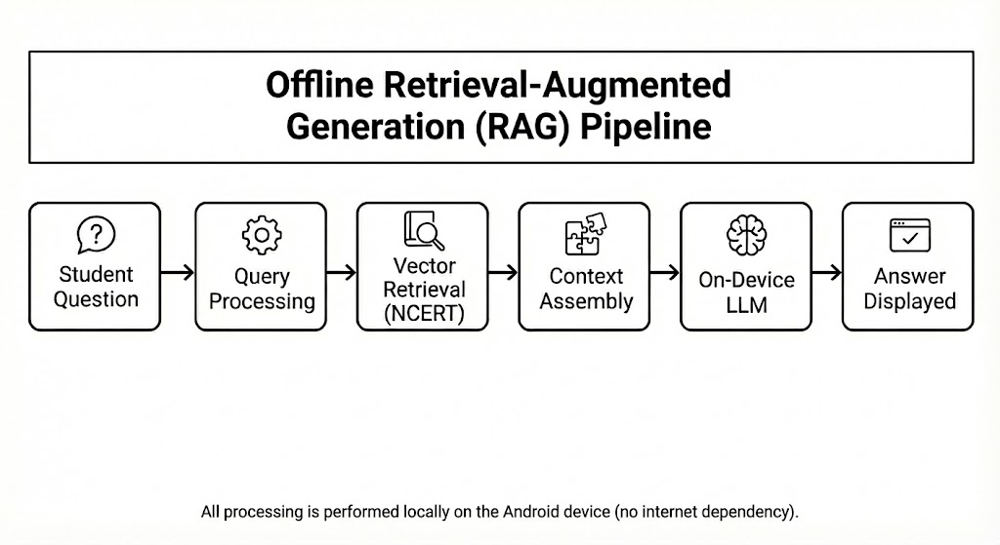
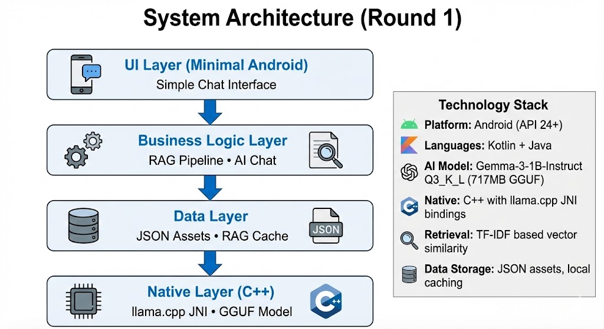

# LearnLoop: Offline AI Learning Assistant for Indian Schools

**Team:** Silent Loop  
**Contact:** mail.mayank001@gmail.com

---

## 🎯 Project Theme: App + GOV

**Empowering Government Education Through Offline AI Technology**

LearnLoop is designed specifically for **government schools and rural education initiatives** where internet connectivity is limited and device resources are constrained. This project bridges the digital divide by bringing AI-powered personalized learning assistance to government students who need it most.

**Key Government Alignment:**
- 🏛️ **NEP 2020 Compliance**: Supports AI-enabled personalized learning goals
- 🇮🇳 **Digital India Ready**: Works without internet infrastructure
- 📚 **NCERT-Aligned**: Official government curriculum integration
- 💰 **Cost-Effective**: Minimal deployment and operational costs
- 🎓 **Scalable**: Ready for state-level and national rollout
- 🔒 **Data Sovereignty**: No cloud dependency, all data stays on-device

**Perfect for:** PM eVIDYA, Samagra Shiksha, State Education Departments, Government Schools, Rural Learning Centers, Common Service Centers (CSCs)

---

## Problem Statement

A large number of primary and secondary school students in India, particularly in government and rural schools, face persistent barriers to accessing personalized educational support.

**Key challenges:**

- **Limited Internet Availability**: Many schools and households experience unreliable or no internet connectivity
- **Device Constraints**: Students rely on low-end Android devices (2-3 GB RAM)
- **High Student-Teacher Ratios**: Teachers cannot provide individual doubt resolution
- **Digital Infrastructure Gaps**: Existing AI education solutions require continuous connectivity and powerful hardware

These constraints demand an educational support system that is **curriculum-aligned, intelligent, and fully offline on low-specification devices**.

---

## Proposed Solution

An **offline AI-powered learning assistant** designed for Indian primary and secondary education contexts.

**Core characteristics:**

- **Fully Offline Operation**: All AI inference performed locally, zero internet dependency
- **NCERT Curriculum Alignment**: Responses grounded in official NCERT textbooks
- **Low-Resource Design**: Optimized for devices with 2-3 GB RAM
- **Retrieval-Augmented Generation (RAG)**: Local RAG reduces hallucination, improves accuracy

---

## Round 1 Implementation

### What We Built

A **minimal viable prototype** validating offline AI feasibility:

- ✅ Offline chat interface for natural language questions
- ✅ NCERT-grounded retrieval from locally stored textbooks
- ✅ On-device LLM running entirely on Android
- ✅ Working RAG pipeline (query → retrieval → context → inference → response)
- ✅ Tested on devices with 2-3 GB RAM

### App Preview

**Screenshots**

<div align="center">
  
  
  
</div>


### Core Functionality

**Offline RAG Pipeline**

```
User Query → Query Processing → Vector Retrieval (NCERT) 
    → Context Injection → Local LLM → Response
```

**Key Components:**

1. **Query Processing**: Normalizes student questions, identifies subject/topic context
2. **Retrieval Engine**: Searches pre-embedded NCERT content using TF-IDF vector similarity
3. **Context Assembly**: Combines retrieved text chunks with query
4. **On-Device Language Model**: Gemma-3-1B (717MB, Q3 quantized) generates grounded responses
5. **Response Delivery**: Presents answer in student-friendly language

**Detailed Pipeline Architecture:**

```
User Query
    ↓
[1] Greeting Detection → Return friendly response
    ↓
[2] Query Cache Check → Return if cached
    ↓
[3] TF-IDF Search → Find top 4 chunks (score ≥ 0.12)
    ↓
[4] Markdown Cleanup → Remove formatting artifacts
    ↓
[5] Context Building → Combine chunks with metadata
    ↓
[6] Prompt Assembly → Add anti-hallucination rules
    ↓
[7] GGUF Inference → Generate response
    ↓
[8] Output Cleanup → Remove symbols
    ↓
[9] Cache & Display → Store result, show to user
```

**RAG Pipeline Flowchart**

<div align="center">
  
  <p><em>Complete Retrieval-Augmented Generation Pipeline</em></p>
</div>

---

## Technical Architecture

### System Stack (Round 1)

```
┌─────────────────────────────────────────┐
│        UI Layer (Minimal Android)       │
│         Simple Chat Interface           │
└────────────────┬────────────────────────┘
                 │
┌────────────────┴────────────────────────┐
│       Business Logic Layer              │
│      RAG Pipeline • AI Chat             │
└────────────────┬────────────────────────┘
                 │
┌────────────────┴────────────────────────┐
│          Data Layer                     │
│     JSON Assets • RAG Cache             │
└────────────────┬────────────────────────┘
                 │
┌────────────────┴────────────────────────┐
│       Native Layer (C++)                │
│    llama.cpp JNI • GGUF Model           │
└─────────────────────────────────────────┘
```

**Technology:**

- **Platform**: Android (API 24+)
- **Languages**: Kotlin + Java
- **AI Model**: Gemma-3-1B-Instruct Q3_K_L (717MB GGUF)
- **Native**: C++ with llama.cpp JNI bindings
- **Retrieval**: TF-IDF based vector similarity
- **Data Storage**: JSON assets, local caching

**System Architecture Diagram**

<div align="center">
  
  <p><em>Complete system architecture showing component interactions</em></p>
</div> 

---

## Data Source and Handling

### NCERT Textbook Corpus

- **Source**: Official NCERT textbooks for Classes 9-12
- **Format**: JSON with structured chapters and content
- **Coverage**: 2000+ indexed text chunks
  - Mathematics (Chapters 1-12)
  - Science (Physics, Chemistry, Biology)
  - English (Beehive + Moments)
  - Social Science (History, Geography, Economics, Political Science)

### Data Processing Pipeline

1. **Text Extraction**: Content converted to structured JSON
2. **Chunking Strategy**: Semantic chunks maintaining context
3. **Embedding Generation**: TF-IDF vector representations
4. **Index Construction**: Efficient on-device similarity search (MIN_RELEVANCE_SCORE = 0.12)

### Hallucination Mitigation

- **Grounded Generation**: Model receives explicit NCERT context
- **High Threshold**: Only chunks scoring ≥0.12 used
- **Limited Context**: Max 4 chunks to avoid confusion
- **Strict Prompts**: "ONLY use information from context"
- **Source Cleaning**: Removes markdown/citations
- **Output Cleaning**: Strips generated symbols

---

## Performance Metrics

| Metric | First Launch | With Cache |
|--------|--------------|------------|
| App Startup | 5-10 seconds | 50-200ms |
| First Query | 50-100ms | 50-100ms |
| Cached Query | 50-100ms | <1ms |
| RAM Usage | ~1.4-1.7GB | ~1.4GB |
| APK Size | ~750MB | N/A |

**Device Compatibility:**

| Device | RAM | Status |
|--------|-----|--------|
| Redmi Note 5 | 4GB | ✅ Smooth |
| Samsung A30 | 4GB | ✅ Works well |
| Budget devices | 3GB | ✅ Functional |
| Target devices | 2-3GB | ✅ Optimized for this |

### Persistent Caching Strategy

- **First Launch**: Indexes 2000+ chunks → saves to JSON (~5-10s)
- **Subsequent Launches**: Loads from cache (~50-200ms) — **10x faster**
- **Query Caching**: LRU cache for 50 most recent queries
- **Auto Invalidation**: Clears when data structure changes

---

## Current Limitations

- Basic UI focused on functionality over aesthetics
- Text-based interaction only
- No user authentication or state persistence
- No quiz or assessment features
- English queries only
- No analytics or tracking

*These are intentional for Round 1 to validate core offline AI feasibility.*

---

## Scope Decision Rationale

### Why Focus on Core RAG First?

1. **Technical Risk Reduction**: Offline AI on constrained devices is highest risk—validate first
2. **Foundation Before Features**: Solid RAG pipeline is prerequisite for everything else
3. **Engineering Discipline**: MVP principles over feature bloat
4. **Clear Boundaries**: Realistic planning demonstrates project management

### Why Defer Other Features?

- **Quizzes**: Require proven retrieval quality first
- **Authentication**: Introduces complexity not core to AI validation
- **Tracking**: Premature without proven interaction patterns
- **Polished UI**: Secondary to functional validation

This demonstrates **pragmatic engineering** aligned with hackathon evaluation criteria valuing depth over breadth.

---

## What It Validates

- ✅ **Technical Feasibility**: Offline AI for education works on low-end devices
- ✅ **Response Quality**: NCERT-grounded answers are accurate and curriculum-aligned
- ✅ **Performance**: Acceptable latency (50-100ms) on target hardware
- ✅ **Resource Efficiency**: Runs within memory constraints (~2GB RAM)
- ✅ **Scalability**: Handles 2000+ document chunks efficiently

---

## Adaptability to Government Use Cases

### NEP 2020 and Digital India Alignment

- **NEP 2020 Goals**: AI-enabled personalized learning without internet infrastructure
- **Digital India Mission**: Democratizes AI for rural populations
- **Skill Development**: Builds conceptual foundations for future learning

### Potential Government Program Extensions

**Samagra Shiksha Integration**
- State-level education improvement initiatives
- Standardized learning support across districts
- Monitor common conceptual gaps

**PM eVIDYA Complement**
- Offline companion to online learning
- Bridge connectivity gaps in DTH/radio education
- Interactive component to broadcast content

**Rural Library/CSC Deployment**
- Shared devices in community centers
- Adult education programs
- Vocational training content

**Exam Preparation Support**
- State board examination preparation
- Board-specific practice
- Supplement unavailable coaching

### Scalability

- **Low Marginal Cost**: Near-zero distribution cost
- **No Infrastructure Dependency**: Works without connectivity
- **Classroom Ready**: No technical expertise required
- **Policy-Compatible**: No cloud data transfer, meets data sovereignty requirements

---

## Round 2 Plans

If selected, we will add these enhancements:

### 1. User Authentication & Profiles
- Secure login and user profiles
- Multi-user support on shared devices

### 2. Interactive Quiz System
- MCQs, True/False, Fill-in-the-blanks
- Subject-wise organization aligned with NCERT
- Progress tracking

### 3. Streak Tracking & Gamification
- Daily study streaks
- Achievement badges
- Progress dashboard

### 4. Modern UI/UX
- Material Design 3 interface
- Smooth animations
- Improved visual design

These build upon the validated Round 1 foundation while maintaining offline-first architecture.

---

## Project Structure

```
Code/
├── app/src/main/
│   ├── java/com/example/learnloop/
│   │   ├── ai/                    # AI Integration (Hidden)
│   │   │   ├── GGUFModelLoader.kt (Model loading)
│   │   │   ├── GGUFChat.kt        (Chat interface)
│   │   │   └── LlamaNative.kt     (JNI bindings)
│   │   ├── rag/                   # RAG Pipeline (Hidden)
│   │   │   ├── RAGPipeline.kt     (Main RAG logic)
│   │   │   ├── RAGCache.kt        (Persistent caching)
│   │   │   ├── VectorStore.kt     (Vector similarity)
│   │   │   ├── TFIDFEmbedder.kt   (TF-IDF embeddings)
│   │   │   └── DataChunker.kt     (Document processing)
│   │   └── [Activities]           (UI components)
│   ├── cpp/                       # Native C++ code
│   │   ├── llama_jni.cpp          (JNI implementation)
│   │   └── CMakeLists.txt
│   └── assets/
│       ├── ai_data/               # NCERT curriculum JSON
│       └── models/                # GGUF model (717MB)
└── docs/
```

---

## Development Philosophy

- **Inclusive Design**: Built for users with the most constraints
- **Technical Pragmatism**: Feasible, measurable outcomes
- **Education-First**: Every decision serves pedagogical value
- **Iterative Validation**: Prove hypotheses before expanding

---

## Evaluation Summary

**For judges and evaluators:**

- **Innovation**: Offline RAG on low-memory mobile devices
- **Social Impact**: Addresses educational equity in India
- **Technical Validation**: Working prototype proves feasibility
- **Scalability**: Architecture supports millions of users at low cost
- **Alignment**: Serves government education digitalization goals
- **Discipline**: Focused MVP with clear Round 2 roadmap

---

## Team

**Team Silent Loop** - Building offline AI education for India

| Member | Role | Contribution | LinkedIn |
|--------|------|--------------|----------|
| **Mayank** | App Dev + Web Developer | Developed the Android application and created project documentation | [LinkedIn](https://www.linkedin.com/in/vortex-m) |
| **Aleena** | AI Model Maker & Idea Generator | Designed and optimized the AI model, conceptualized the core idea | [LinkedIn](https://www.linkedin.com/in/aleena-t-r-0ba237285) |
| **Harshit Tandon** | App Developer | Developed application features and implemented core functionality | [LinkedIn](https://www.linkedin.com/in/hartan9124) |
| **Geetika Saini** | Data Researcher & AI Integration | Gathered NCERT curriculum data and integrated AI model into the app | [LinkedIn](https://linkedin.com/in/geetika-saini) |

---

## Acknowledgments

- **llama.cpp**: Efficient LLM inference engine
- **NCERT**: Educational curriculum content
- **Hugging Face**: AI model hosting

---

## Installation

**Download the App**

<div align="center">
  
  <p><em>Scan QR code to download LearnLoop APK</em></p>
  <p><strong>OR</strong></p>
  <p><a href="releases/learnloop.apk">📥 Direct Download APK</a></p>
</div>

**System Requirements:**
- Android 7.0 (API 24) or higher
- 2-3GB RAM minimum
- 2GB free storage space

---

**Team:** Silent Loop  
**Contact:** mail.mayank001@gmail.com  
**Status:** Round 1 Complete ✅ | Ready for Round 2 🚀
